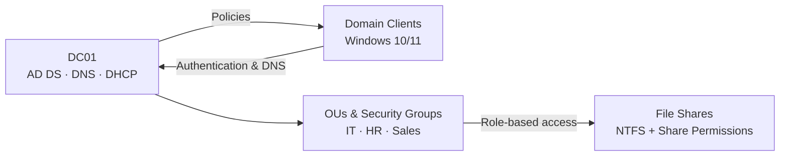

# Windows Server 2022 Enterprise Infrastructure Lab

> A hands-on systems administration project demonstrating centralized identity, network services, policy enforcement, and role-based file access in a simulated business environment.

**Author:** Junior Kalomba  
**Role:** Systems Administrator  
**Environment:** VMware Workstation · Windows Server 2022 · Windows 10/11  
**Domain:** `kalomba.local`

---

## Project Overview

This lab simulates a small enterprise Windows environment built around a Windows Server 2022 domain controller. The infrastructure centralizes user authentication, automates client network configuration, applies security policies through Group Policy, and protects shared business data with role-based permissions.

## Architecture

## Technologies

- Windows Server 2022
- Active Directory Domain Services (AD DS)
- DNS and DHCP
- Group Policy Management
- NTFS and share permissions
- Windows 10/11 clients
- VMware Workstation

## What I Implemented

- Promoted `DC01` as the domain controller for `kalomba.local`
- Configured a static server IP address of `192.168.1.10`
- Created structured Organizational Units for IT, HR, and Sales
- Provisioned users, security groups, and department-based access
- Deployed a DHCP scope from `192.168.1.100` to `192.168.1.200`
- Configured DNS for domain-level name resolution
- Enforced password complexity and user restrictions with GPOs
- Mapped network drives through Group Policy
- Secured departmental shares using NTFS and share permissions

## Deployment Process

### 1. Server Preparation

Renamed the Windows Server host to `DC01` and assigned a static IP address to provide consistent directory, DNS, and DHCP services.

### 2. Active Directory Deployment

Installed AD DS, promoted `DC01` to a domain controller, and created the `kalomba.local` forest.

### 3. Identity and Access Structure

Created IT, HR, and Sales OUs, then organized user accounts and security groups according to department and access requirements.

### 4. Network Services

Installed and authorized DHCP, created the client address scope, and configured DNS to support domain services and client name resolution.

### 5. Group Policy

Used Group Policy Management to:

- Enforce password complexity
- Restrict Control Panel access for designated users
- Map departmental network drives

### 6. Secure File Services

Created departmental shares such as `HR_Reports` and `Sales_Data`, then combined share permissions with NTFS permissions to enforce least-privilege access.

## Validation

The environment was validated by:

- Joining Windows clients to the domain
- Authenticating with domain user accounts
- Confirming automatic DHCP addressing
- Testing internal DNS resolution
- Verifying GPO application on client systems
- Testing authorized and unauthorized access to departmental shares

## Skills Demonstrated

- Windows Server administration
- Active Directory design and user lifecycle management
- DNS and DHCP configuration
- Group Policy deployment
- Role-based access control
- NTFS and share permission management
- Virtualized infrastructure deployment
- Technical documentation and validation

## Project Documentation

The complete report includes configuration steps and screenshots from the lab.

[**View the full Windows Server project report (PDF)**](Junior_Kalomba_Windows_Server_Project_Final.pdf)

---

### Connect with me

- [GitHub](https://github.com/Juniorklb)
- [Portfolio](https://juniorkalomba.netlify.app/)
